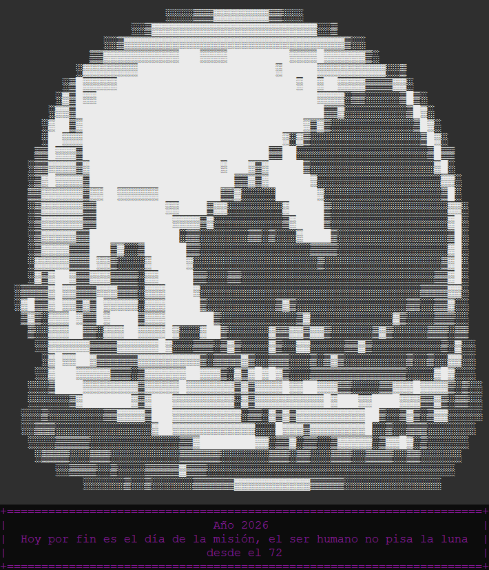

# Aventura Conversacional: Project 7 Days

## Descripción General
Project 7 Days es un juego interactivo, desarrollado en Java utilizando exclusivamente estructuras de control básicas, y con el uso de la consola como interfaz gráfica.  

Este juego sumerge a los usuarios en una aventura narrativa donde cada decisión tomada es crucial para determinar el curso de la historia. El objetivo final es un viaje al espacio, sin embargo, las decisiones pueden variar el rumbo. Estas, junto a los resultados de los enfrentamientos pueden desembocar en múltiples finales.

## Vista previa 

## Estructura del Código
El código se estructura mediante archivos de clases, los cuales son:

- **``Recursos``**: Almacena los textos ASCII en variables estáticas y los colores para aplicar a las impresiones.
- **``FuncionesDialogo``**: Contiene las funciones de mayor complejidad relacionadas a la impresión y creación de secciones de texto, coloreados, en caja, centrados, entre otros.
- **``Diálogo``**: Alberga los cuadros de texto específicos que se generan usando las funciones de texto de caja de FuncionesDialogo.
- **``Main``**: Maneja el flujo principal de la historia, almacena las variables, hace llamada a las funciones que se requieran en el código principal y crea las funciones de debugger de Scanner y de manejo de batallas.

### Entrada y Salida de Datos
La entrada de los datos es a través del _Scanner_ que lee la consola, y que se declara de manera estática en ``Main``. Las salidas por consola se manejan con los métodos de “_System.out_”, donde se imprimen textos simples, los textos ASCII almacenados en ``Recursos``, textos que pasan por funciones de ``FuncionesDialogo`` para adquirir un color, centrarse, etc, y diálogos almacenados en ``Diálogo``.

### Refactorizaciones
Durante el desarrollo del código, se presento la necesidad de múltiples refactorizaciones, relacionadas a la replantación de la lógica, la reducción de la complejidad y del uso de elementos avanzados propios del lenguaje de Java, como el uso de ArrayLists hacia Arrays simples.

### Manejo de Errores
El manejo de errores del código se basó en el uso de las estructuras de control del _while_ y el _do…while_, deteniendo la ejecución hasta que el usuario ingrese una opción válida.

### Documentación
Todas las funciones de texto, y de batallas cuentan con un formato de documentación de JavaDocs, donde se indica la funcionalidad final de la función, los parámetros que recibe y el return.

## Creadores

- [Ruben Mansilla](https://www.linkedin.com/in/ruben-mansilla-rodriguez-/) 
- [Hugo Gago](https://github.com/ggdsrll) 
- [Ángel García Beltrán](https://www.linkedin.com/in/%C3%A1ngel-garc%C3%ADa-beltr%C3%A1n/)

## Contribución

No se aceptan contribuciones en este proyecto.
